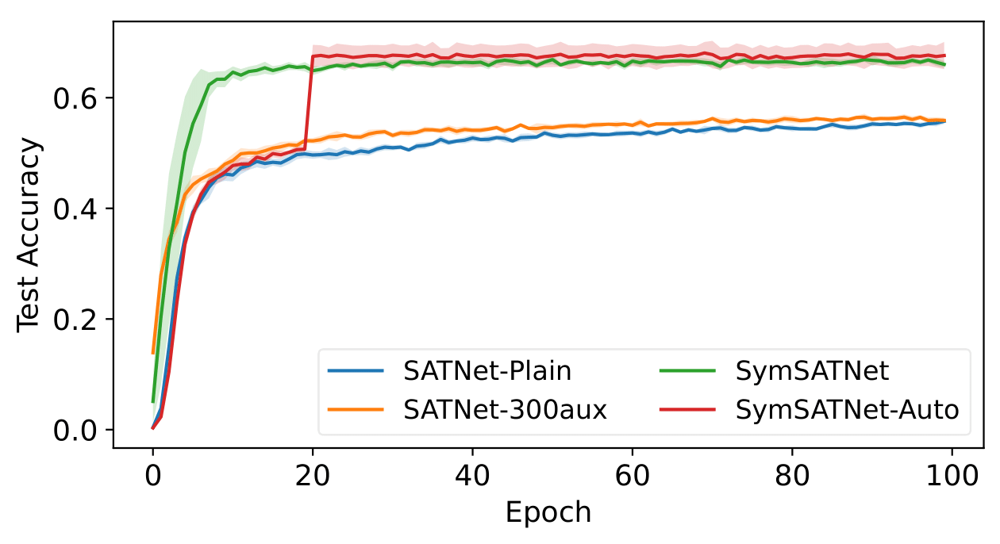

# Learning Symmetric Rules with SATNet

## 1. Dependencies
We only provide the GPU implementation of SymSATNet.
The experiment was conducted in a Linux conda environment, and we used python 3.8 and pytorch 1.8.0 with CUDA 11.1 to install SATNet, SymSATNet packages.
We recommend creating a new conda environment and installing those packages on the environment by the following commands.

    conda create -n satnet python=3.8
    conda activate satnet
    conda install pytorch==1.8.0 torchvision==0.9.0 torchaudio==0.8.0 cudatoolkit=11.1 -c pytorch -c conda-forge

Now, we can install SATNet:

    git clone https://github.com/locuslab/SATNet ./src/SATNet
    python src/SATNet/setup.py install

or via pip:

    pip install satnet

and install SymSATNet by the following.

    python src/SymSATNet/setup.py install
    
SATNet and SymSATNet also require the following packages.

    conda install -c pytorch tqdm
    conda install -c anaconda ipython
    conda install -c anaconda scikit-learn
    conda install -c conda-forge matplotlib

## 2. Related Work
- The implementation of SymSATNet is based on [the original SATNet code](https://github.com/locuslab/SATNet) by [Wang et. al.](http://proceedings.mlr.press/v97/wang19e.html) [2019] available under an MIT License which is also contained in this repository.

- We used the Sudoku generator in [this repository](https://github.com/Kyubyong/sudoku) by Park [2018].

## 3. SymSATNet
SymSATNet is a variant of SATNet, which abbreviates symmetry-aware SATNet.
SymSATNet assumes that some symmetries of the target rules are given a priori although the rules themselves are unknown.
We incorporated the symmetries into the SATNet's objective, and derive the equivariance requirement of the paramteter matrix of SATNet.
Consequently, SymSATNet can learn with significantly reduced number of parameters using the basis elements of the space of equivariant matrices.

## 4. SymFind
SymFind is an automatic symmetry-detection algorithm, which receives a matrix $M$ as an input and returns a permutation group $G$ which closely approximates the symmetries in $M$: $\forall g \in G, \, gM \approx Mg$. The group symmetries discovered by SymFind can be used to train SymSATNet. Symfind can find the permutation groups defined by a manually designed grammar that covers a suitable range of practical permutation groups. SymFind calls two subroutine algorithms, SumFind and ProdFind, which may also recursively call SymFind to find the symmetries for smaller parts in M. 

- SumFind clusters entries in the input matrix as blocks since block-shaped clusters commonly arise in matrices equivariant with respect to a direct sum of groups.

- ProdFind exploits a typical pattern of Kronecker product of matrices, and detects the presence of the pattern by applying SVD.

## 5. Tasks
Our first task is Sudoku. Sudoku has group symmetries represented by $G = (S_3 \wr S_3) \otimes (S_3 \wr S_3) \otimes S_9$. The following are three examples of permutations that preserve the validity of Sudoku solutions.

</img> 
</img> 
</img>

Our second task is the completion problem of Rubik's cube.
The player is asked to find a color assignment of the Rubik's cube that is solvable.
This problem has group symmetries represented by $G = R_{54} \otimes R_6$. Here $R_{54}$ is the Rubik's cube group, and $R_6$ is the permutation group generated by 3-dimensional $90^\circ$ rotations.

</img>

## 6. Training and Results
The following two plots show the test accuracy of each model in Sudoku and Rubik's cube during the 100 epochs of training.

</img>
</img>

Also, the following two plots show the test accuracy of each model in noisy Sudoku and noisy Rubik's cube with respect to the number of corrupted cells or facelets.

</img>
</img>

See main.py and experiment.ipynb for more information.